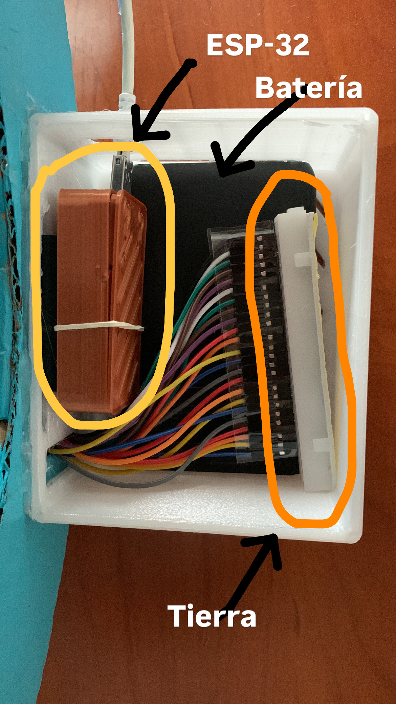
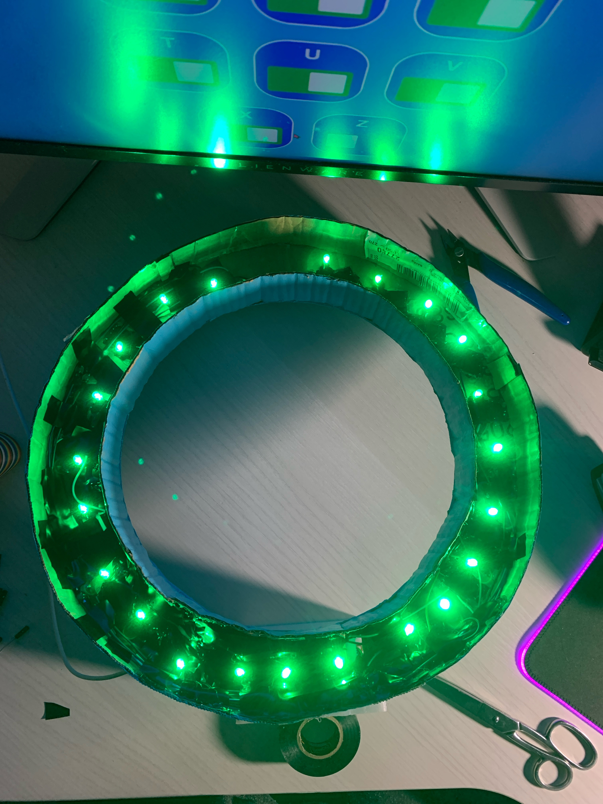
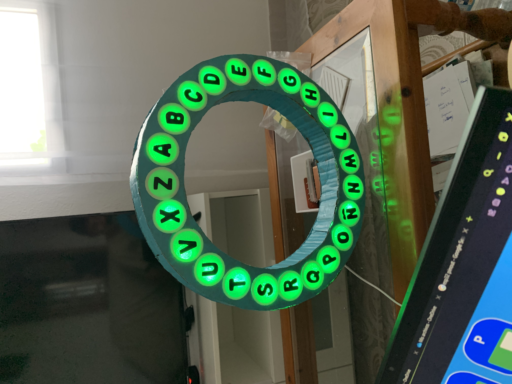

# ESP32-rosco-game
Herramienta de gamificación para aulas de Audición y Lenguaje (AL/PT). Adapta la mecánica del 'Pasapalabra' al abecedario gallego para alumnos con necesidades especiales. Hardware basado en ESP32 con control vía WebSockets e interfaz web simplificada.
 
Montaje:
<ol>
  <li>Lógica de control</li>
  <ul>
    <li>Batería externa portátil</li>
    <li>Microcontrolador ESP32</li>
    <li>Toma de tierra</li>
  </ul>
  

   
  

  <li>Esqueleto del rosco</li>
  

   
  

  <li>Rosco funcional</li>
  

   
  

</ol>
